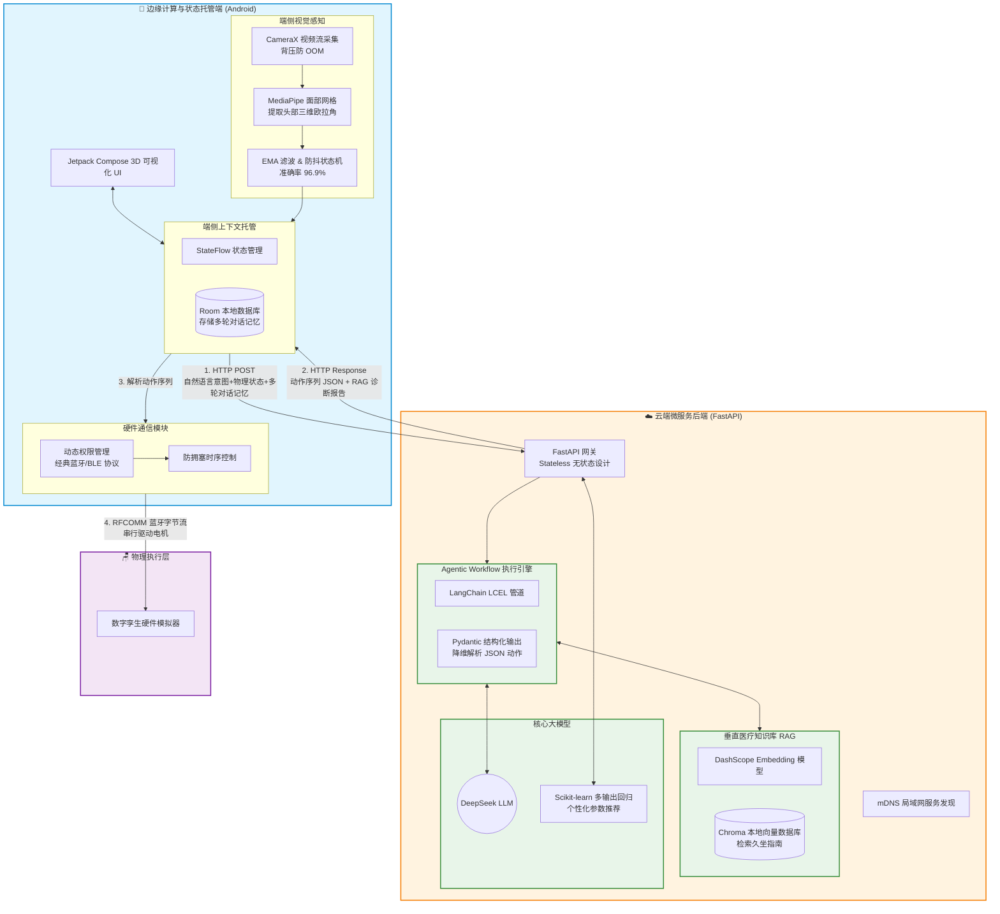

#  基于大模型与云边端协同的智能座椅健康管家 (AI 云端)

> **提示**：本项目为《智能座椅健康管家》的 **云端 AI 推理与大模型微服务部分**。
> **配套的 Android 端侧感知与 UI 源码请移步至**：https://github.com/Droate/smart-chair-spine-frontend

## 项目简介
本项目是《智能座椅健康管家》的后端与 AI 核心。主要提供基于大模型 Agent 的自然语言意图解析、基于 RAG 架构的健康报告生成，以及无状态并发隔离的 API 服务。

## 核心技术栈
* **后端框架**: Python, FastAPI
* **大语言模型**: LangChain, DeepSeek LLM
* **RAG 架构**: ChromaDB (向量数据库), 阿里百炼 DashScope (Embedding 模型)
* **机器学习**: Scikit-learn (多输出线性回归模型)

## 核心亮点
* **Agentic Workflow**：基于 LangChain (LCEL) 将自然语言意图精准降维为底层物理设备动作序列，打通“零触控”驱动闭环。
* **权威医学 RAG**：对《世卫组织久坐指南》进行切片与向量化检索，有效消除大模型生成健康建议时的“幻觉”。
* **无状态安全架构**：针对多用户并发越权隐患，采用彻底的 Stateless 设计，配合端侧实现绝对的会话隔离与数据安全。

